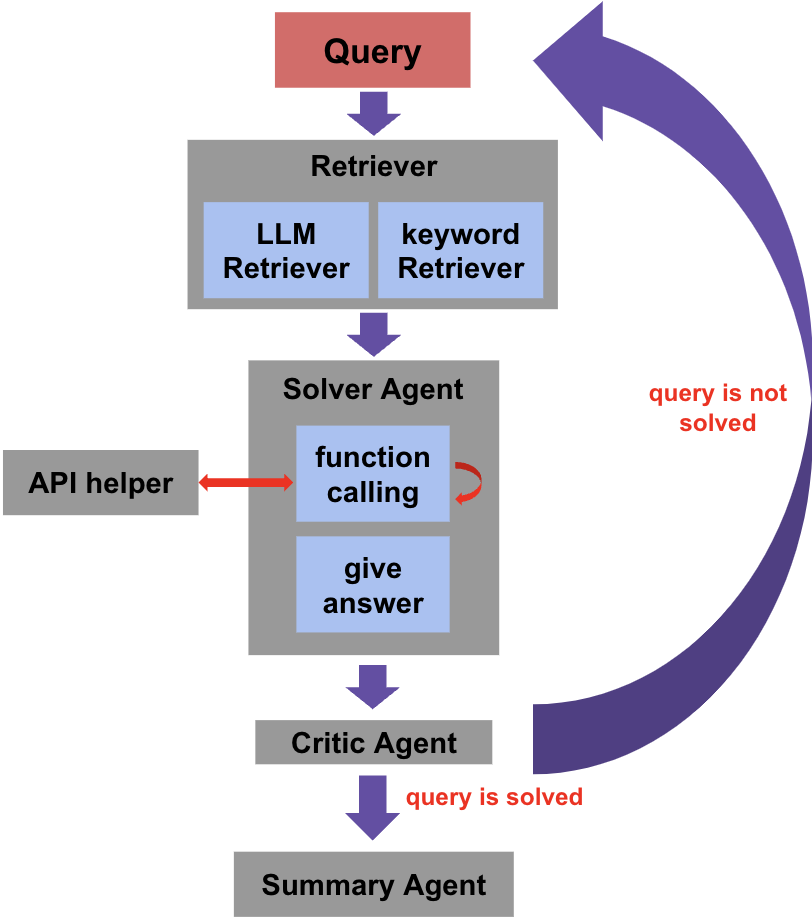

# 百度搜索·文心智能体创新大赛”技术赛道：基于多工具调用的开放域问答智能体构建

## [竞赛链结](https://aistudio.baidu.com/competition/detail/1235/0/introduction)
## 团队信息
1. **队名**：初级程序员的团队
2. **队员**：胡太维（队长）
3. **初赛名次**：7 / 1008
4. **决赛名次**：8 / 30 (优胜奖🥇)

## 架构图


## 安装
```
pip install -r requirements.txt
```

## 百度千帆 Token
请改写 `src/constants.py` 中的 `AK` 与 `SK`

## 使用方法
```python
python tools/inference_re.py --config_file config/taiwei-agent.yaml \
                             --dataset dataset.json \
                             --topk 5 \
                             --save_path result.json \
                             --max_iter 10 8 8 7
```
+ `config_file`：配置文件。
+ `dataset`：问题集的 JSON 档路径。
+ `topk`：每一轮 LLM retriever 最多提取的工具个数。
+ `save_path`：系统回答结果的 JSON 档储存路径。
+ `max_iter`：每一轮的对话次数。以 `10 8 8 7` 为例，表示共有 4 轮对话，每轮对话的次数分别为 `10, 8, 8, 7`。